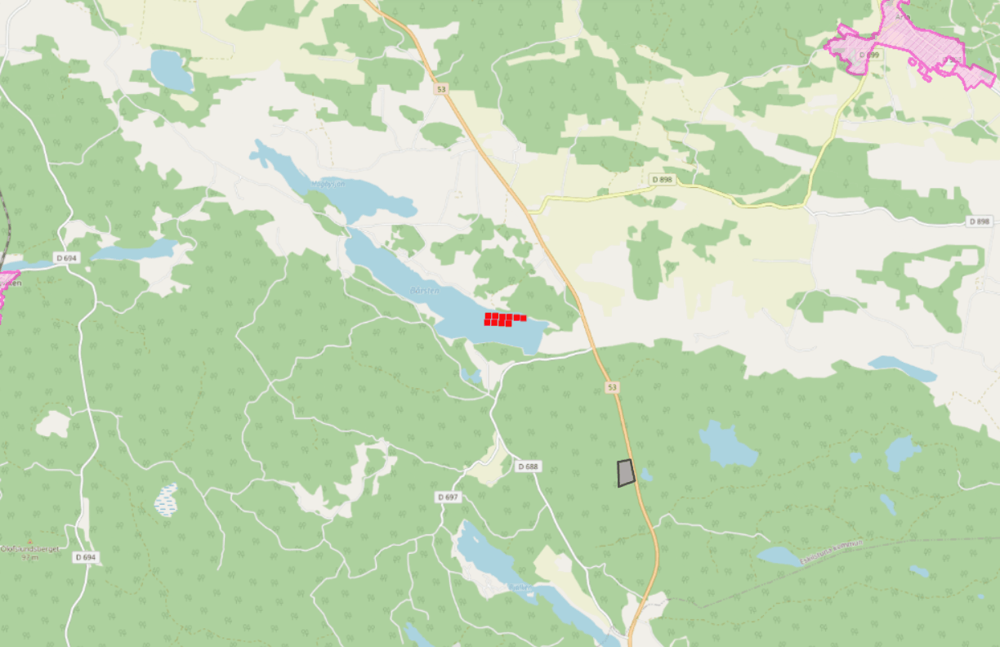

# iwMinimizer

Ger möjlighet att minimera infowindow när en selektion har gjorts.
Minimering görs genom att klicka på gruppens namn i infowindow.
Alternativt kan också en minimerings-knapp visas.

**Parametrar:**
- showMinimizeButton: Om knapp för att minimera ska visas. **Valfri.**

**Exempel:**
```HTML
<script type="text/javascript">
    var origo = Origo('index.json');
    origo.on('load', function (viewer) {
      var iwMinimizer = IwMinimizer({
          showMinimizeButton: true
        });
      viewer.addComponent(iwMinimizer);
    });
</script>
```

### Demo minimering

